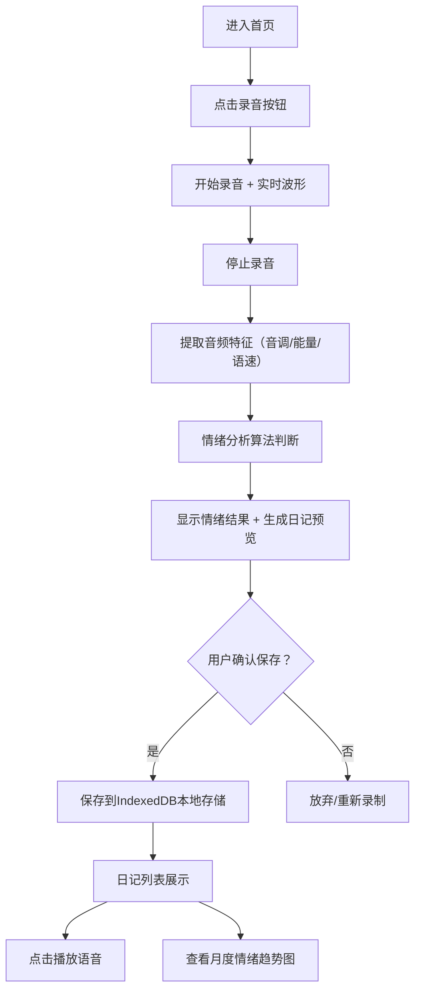

## 1. 产品概述
语音情绪日记是一款通过录音记录生活、自动分析语音情绪并生成带情绪标签日记的个人应用。所有数据本地存储，保护用户隐私，支持回顾心情变化趋势。

- 核心价值：让用户通过语音快速记录生活，自动识别情绪，可视化追踪心情变化
- 目标用户：希望记录生活、关注心理健康的普通用户

## 2. 核心功能

### 2.1 功能模块
1. **首页/录音页**：大型录音按钮、实时波形动画、情绪分析结果展示
2. **日记列表页**：日记卡片列表、情绪颜色标签、日期、播放按钮
3. **情绪趋势页**：月度情绪曲线图、情绪分布统计

### 2.2 页面详情
| 页面名称 | 模块名称 | 功能描述 |
|-----------|-------------|---------------------|
| 录音页 | 录音控制区 | 点击开始/停止录音，显示录音时长和实时波形 |
| 录音页 | 情绪分析区 | 录音完成后自动分析，显示情绪结果（开心/平静/悲伤/愤怒/焦虑）和置信度 |
| 录音页 | 日记预览区 | 显示自动生成的日记条目，可编辑文字，确认保存 |
| 日记列表页 | 日记卡片 | 展示日期、情绪颜色标签、语音播放条、日记文字 |
| 日记列表页 | 筛选排序 | 按日期/情绪筛选，时间排序 |
| 情绪趋势页 | 月度曲线图 | X轴日期，Y轴情绪分值，折线图展示当月心情变化 |
| 情绪趋势页 | 情绪分布 | 饼图展示各情绪占比 |

## 3. 核心流程
用户点击录音按钮开始说话，停止后系统自动提取音频特征（音调、能量、语速等）判断情绪，生成带情绪标签的日记条目，用户确认后保存到本地存储。用户可在列表页回顾所有日记，在趋势页查看月度心情变化。

## 4. 用户界面设计

### 4.1 设计风格
- **主色调**：温暖柔和的奶油米色背景，配合情绪渐变色（开心-橙黄、平静-青绿、悲伤-淡蓝、愤怒-玫红、焦虑-淡紫）
- **按钮风格**：大型圆形录音按钮，带有呼吸光晕动效，点击时有脉冲反馈
- **字体**：标题使用优雅衬线字体 Lora，正文使用现代无衬线字体 Inter
- **布局风格**：卡片式布局，圆润边角，柔和阴影，大量留白
- **图标风格**：Lucide 图标，线条纤细柔和

### 4.2 页面设计概述
| 页面名称 | 模块名称 | UI元素 |
|-----------|-------------|-------------|
| 录音页 | 录音按钮 | 120px圆形，渐变背景，录音时脉冲动画，光晕扩散效果 |
| 录音页 | 波形动画 | Canvas绘制实时音频波形，渐变色频谱 |
| 录音页 | 情绪结果卡片 | 背景色匹配情绪，带emoji图标，置信度进度条 |
| 日记列表页 | 日记卡片 | 左侧情绪色条，日期时间，播放按钮，文字摘要 |
| 情绪趋势页 | 折线图 | 平滑曲线，数据点带情绪色圆点，悬浮显示详情 |

### 4.3 响应式
桌面端优先设计，移动端自适应布局，录音按钮在移动端居中放大，列表页单列展示。
