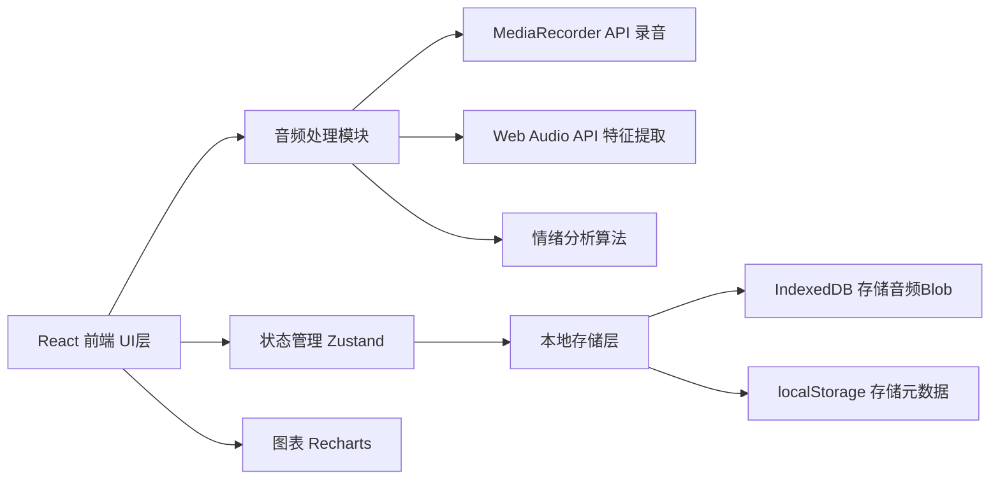
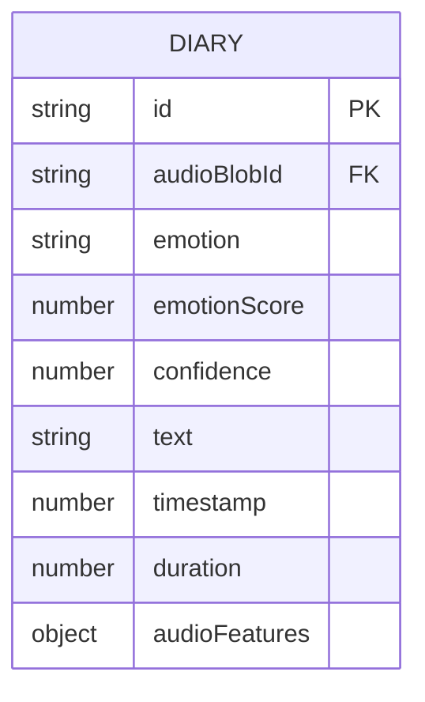

## 1. 架构设计



## 2. 技术描述
- **前端框架**：React@18 + TypeScript + Vite
- **样式方案**：TailwindCSS@3
- **状态管理**：Zustand
- **路由**：React Router DOM
- **音频处理**：MediaRecorder API + Web Audio API（AudioContext、AnalyserNode）
- **图表库**：Recharts
- **图标**：Lucide React
- **数据存储**：IndexedDB（idb封装）存储音频文件，localStorage存储日记元数据

## 3. 路由定义
| Route | Purpose |
|-------|---------|
| / | 首页/录音页，核心录音和情绪分析功能 |
| /diaries | 日记列表页，展示所有历史日记 |
| /trends | 情绪趋势页，月度情绪曲线和统计 |

## 4. 数据模型

### 4.1 数据模型定义



### 4.2 TypeScript 类型定义

```typescript
type EmotionType = 'happy' | 'calm' | 'sad' | 'angry' | 'anxious';

interface AudioFeatures {
  pitchMean: number;      // 平均音调
  pitchStd: number;       // 音调标准差
  energyMean: number;     // 平均能量
  energyStd: number;      // 能量标准差
  speechRate: number;     // 语速估计
  zeroCrossingRate: number; // 过零率
}

interface DiaryEntry {
  id: string;
  audioBlobId: string;
  emotion: EmotionType;
  emotionScore: number;   // 1-10 情绪分值
  confidence: number;     // 0-1 置信度
  text: string;           // 日记文字（可编辑）
  timestamp: number;      // 创建时间戳
  duration: number;       // 录音时长（秒）
  audioFeatures: AudioFeatures;
}

interface EmotionConfig {
  type: EmotionType;
  label: string;
  emoji: string;
  color: string;
  bgColor: string;
}
```

## 5. 核心模块设计

### 5.1 录音模块 (useAudioRecorder hook)
- `startRecording()`: 请求麦克风权限，创建 MediaRecorder，开始录音
- `stopRecording()`: 停止录音，返回 Blob 和 AudioBuffer
- 实时回调：提供音频数据用于波形绘制

### 5.2 音频特征提取模块 (audioFeatures.ts)
- `extractPitch(audioBuffer)`: 基于自相关算法提取基频
- `extractEnergy(channelData)`: 计算 RMS 能量
- `extractZeroCrossingRate(channelData)`: 计算过零率
- `estimateSpeechRate(audioBuffer, sampleRate)`: 估计语速
- `extractAllFeatures(audioBuffer)`: 提取全部特征

### 5.3 情绪分析模块 (emotionAnalysis.ts)
- 基于规则的情绪分类：根据各特征阈值判断情绪
- 情绪分值映射：将特征组合映射为 1-10 的分值
- 返回情绪类型 + 置信度

### 5.4 本地存储模块 (storage.ts)
- IndexedDB 封装：存储音频 Blob
- localStorage：存储日记数组（不含音频数据）
- CRUD 操作：增删改查日记条目

## 6. 情绪颜色配置
| 情绪 | 标签 | Emoji | 主色 | 背景色 |
|------|------|-------|------|--------|
| happy | 开心 | 😊 | #F59E0B | #FEF3C7 |
| calm | 平静 | 😌 | #10B981 | #D1FAE5 |
| sad | 悲伤 | 😢 | #3B82F6 | #DBEAFE |
| angry | 愤怒 | 😠 | #EF4444 | #FEE2E2 |
| anxious | 焦虑 | 😰 | #8B5CF6 | #EDE9FE |
